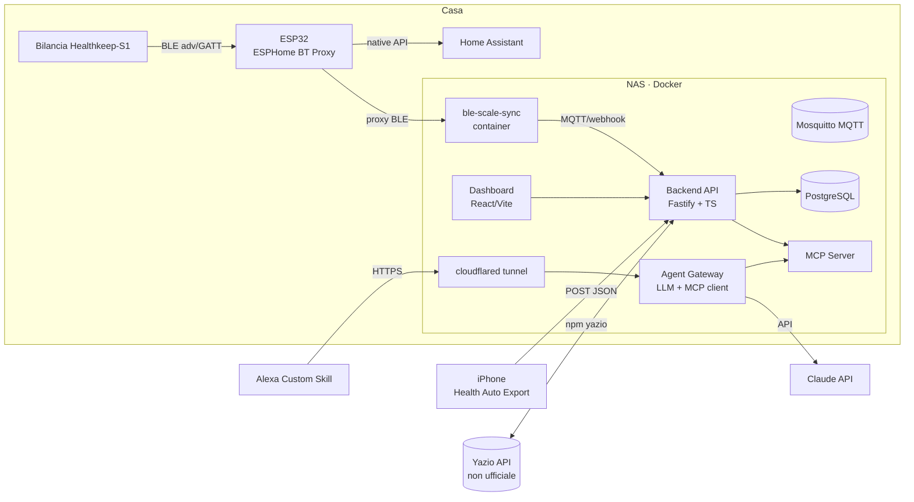
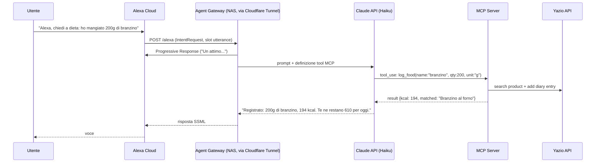

# Nutridock — Piattaforma Self-Hosted per Salute, Pasti e Dispensa

> Documento di progetto — v1.0 · Luglio 2026
> Target: NAS con Docker · Stack TypeScript/Node · Home Assistant + ESP32 già disponibili

---

## 1. Visione d'insieme

Una piattaforma self-hosted che unifica tre flussi dati (bilancia Healthkeep-S1, Yazio, Apple Health) in un unico database locale, ci costruisce sopra un motore di pianificazione pasti AI-driven, e espone tutto sia via dashboard web sia via voce (Alexa → LLM → MCP).



Principio guida: **il database locale è la fonte di verità**. Yazio, Apple Health e la bilancia sono sorgenti di ingestion; tutte le logiche (dashboard, menù, Alexa) leggono solo dal DB locale. Questo isola la piattaforma dalla fragilità delle API non ufficiali e mantiene i dati sanitari in casa.

---

## 2. Stack tecnologico

| Livello | Scelta | Motivazione |
|---|---|---|
| Runtime | Node.js 22 LTS + TypeScript | Allineato ai client Yazio esistenti (npm `yazio`, `yazio-mcp`) e all'SDK MCP ufficiale (`@modelcontextprotocol/sdk`) |
| Backend API | **Fastify** + Zod | Leggero, veloce, validazione schema-first |
| ORM / DB | **Drizzle ORM** + **PostgreSQL 16** | Relazionale per dispensa/ricette/obiettivi/pesate/calorie |
| Job scheduler | **BullMQ** (Redis) | Sync periodici Yazio, generazione menù notturna |
| Frontend | **React + Vite + Tailwind + Recharts**, PWA | SPA servita dallo stesso container; PWA per averla sul telefono |
| Messaging | **Mosquitto (MQTT)** | Bus già naturale nell'ecosistema HA/ESPHome; ble-scale-sync pubblica direttamente su MQTT |
| Bilancia | **ble-scale-sync** (container) | Progetto Node.js GPL-3.0 con 26 adapter di protocollo, incluso ICOMON (chipset delle bilance Fitdays/Healthkeep) e calcolo body composition derivato da openScale |
| MCP Server | `@modelcontextprotocol/sdk` (TS) | Espone i tool del dominio all'LLM |
| LLM | Claude API (Haiku per Alexa, Sonnet per generazione menù) | Haiku per latenza voce; Sonnet per pianificazione complessa |
| Alexa | ASK SDK v2 for Node.js + `ask-sdk-express-adapter` | Verifica firma richieste inclusa; endpoint self-hosted |
| Esposizione | **Cloudflare Tunnel** (`cloudflared`) | HTTPS valido verso il NAS senza aprire porte; requisito per l'endpoint Alexa |
| Deploy | Docker Compose (monorepo pnpm) | Un unico `docker-compose.yml` sul NAS |

### Struttura monorepo

```
healthhub/
├── apps/
│   ├── api/            # Fastify: REST + ingestion endpoints
│   ├── web/            # React dashboard
│   ├── mcp-server/     # MCP server (tool del dominio)
│   ├── agent-gateway/  # Alexa adapter + orchestratore LLM
│   └── workers/        # cron: sync Yazio, sync check, menù notturno
├── packages/
│   ├── db/             # schema Drizzle + migrazioni
│   ├── yazio-client/   # wrapper del pacchetto npm `yazio` (adapter pattern)
│   └── shared/         # tipi, unità di misura, calcoli nutrizionali
└── docker-compose.yml  # postgres, redis, mosquitto, api, web, mcp, gateway, cloudflared, ble-scale-sync
```

### Modello dati (nucleo)

```
body_metrics(ts, weight, impedance, fat_pct, muscle_kg, water_pct, bone_kg, visceral_fat, bmr, protein_pct, metabolic_age, source)
food_log(ts, meal, product_id, name, qty_g, kcal, carbs, protein, fat, source[yazio|voice|manual], yazio_entry_id)                 
activity(date, active_kcal, resting_kcal, steps, exercise_min, source) 
goals(user_id, target_kcal, protein_g, carbs_g, fat_g, target_weight, valid_from)
pantry_items(id, name, qty, unit, category, expires_at, barcode?)
recipes(id, name, servings, kcal, macros, ingredients[] -> pantry match)
menu_plans(date, meal, recipe_id, status[proposed|accepted|eaten])
shopping_list(item, qty, unit, reason, checked)
```

Vista derivata chiave — **bilancio giornaliero**:
`budget_kcal(oggi) = BMR + attività(Apple Health) − deficit_obiettivo − consumato(Yazio)`

---

## 3. Strategia di estrazione dati

### 3.1 Bilancia Healthkeep-S1 — approccio a tre livelli

Fatto determinante: la S1 si appoggia all'app **Fitdays**, cioè chipset **ICOMON**. Non serve (probabilmente) reverse engineering da zero.

**Livello 1 — ble-scale-sync (tentare per primo, ~zero codice).**
[ble-scale-sync](https://github.com/KristianP26/ble-scale-sync) include l'adapter **MGB (Swan/Icomon/YG)** più un adapter catch-all per bilance conformi allo standard Bluetooth SIG (BCS/WSS). Piano:
 
1. Deploy come container Docker sul NAS.
2. Il NAS non ha BLE → si usa il tuo **ESP32 come ESPHome Bluetooth Proxy** (supporto nativo in ble-scale-sync, [guida ufficiale](https://blescalesync.dev/guide/esphome-proxy)). L'ESP32 va posizionato vicino alla bilancia.
3. `npm run scan` / setup wizard: rileva la bilancia, fissi il **MAC address** che già possiedi in `config.yaml` (`scale_mac`) per evitare device estranei.
4. Output: **peso + impedenza grezza** → ble-scale-sync calcola localmente *tutte* le metriche (grasso, muscolo, acqua, ossa, viscerale, BMR…) con le formule derivate da openScale — bypassando completamente i limiti dell'app nativa.
5. Exporter: **MQTT → Home Assistant** (sensori auto-discovery) e **Webhook → backend API** (`POST /ingest/body-metrics`). Supporta multi-utente per pesate di altri familiari.

**Livello 2 — reverse engineering mirato (solo se il L1 fallisce).**
Metodologia derivata dalla [openScale wiki](https://github.com/oliexdev/openScale/wiki/How-to-reverse-engineer-a-Bluetooth-4.x-scale), qui adattata a un setup **iPhone-only e a costo zero** (niente Android, nessun acquisto). L'obiettivo resta identificare la characteristic che notifica peso/impedenza e decodificarne il payload; cambia solo *come catturi* il traffico. Tre strade gratuite, in ordine di semplicità:
 
1. **Esplorazione GATT diretta da iPhone (prova questa per prima).** App gratuite **nRF Connect for iOS** o **LightBlue**: ti connetti tu alla bilancia (senza Fitdays), elenchi i servizi, individui la characteristic vendor (`0xFFFx`) o la standard `0x2A9C` Body Composition Measurement, attivi le notifiche e sali sulla bilancia guardando i byte grezzi arrivare in esadecimale. Correlando il peso mostrato col payload ricavi endianness, scala (/100) e flag di misura stabilizzata. Molte bilance ICOMON espongono peso/impedenza anche nella *manufacturer data* dell'advertisement (visibile in chiaro in nRF Connect mentre cambia): in quel caso non serve nemmeno connettersi. Zero hardware extra, zero costi.
2. **Cattura di ciò che fa Fitdays (con Mac).** Installi sull'iPhone il **Bluetooth debug configuration profile**, riproduci una pesata con Fitdays, poi generi un **sysdiagnose** ed estrai i file `.pklg`, oppure catturi live con **PacketLogger**. I `.pklg` si aprono in PacketLogger o si convertono per Wireshark. Utile se il passo 1 non basta e vuoi vedere l'esatta sequenza dell'app ufficiale.
3. **ESP32 come observer passivo (hardware che hai già).** Lo stesso ESP32 del Livello 1 può loggare le advertisement / fare da sniffer passivo per ispezionare i pacchetti, senza acquistare nulla di dedicato.
Poi, con lo stesso identico procedimento del L1: identifichi la characteristic (vendor `0xFFFx` o standard `0x2A9C`), decodifichi il payload e implementi un **adapter custom per ble-scale-sync** (architettura a plugin, [guida contributing](https://github.com/KristianP26/ble-scale-sync/blob/main/CONTRIBUTING.md)) — così resti dentro l'infrastruttura del Livello 1 e lo contribuisci upstream.
 
> Nota iPhone (vale già per il Livello 1): iOS non espone il MAC BLE reale alle app — restituisce un CoreBluetooth UUID rotante — quindi lo `scale_mac` richiesto dal config **non lo leggi dal telefono**. Lo ricavi dallo `npm run scan` dell'ESP32 (che vede il MAC reale a livello radio) o dall'integrazione Bluetooth di Home Assistant.
 
**Livello 3 — firmware ESP32 dedicato (ultima spiaggia).**
ESP32 con NimBLE che ascolta le advertisement/si connette in GATT alla S1 e pubblica su MQTT. Da considerare solo se ble-scale-sync risultasse inutilizzabile; è più lavoro e duplica ciò che il proxy ESPHome già fa.
 
> Nota: se poi vuoi comunque continuare a usare Fitdays sul telefono, evita che app e bridge si connettano in contemporanea — la maggior parte di queste bilance accetta una sola connessione GATT alla volta. Con la decodifica passiva delle advertisement (se il modello lo consente) il problema non si pone.

### 3.2 Apple Health — export automatizzato

Soluzione: app **[Health Auto Export](https://github.com/Lybron/health-auto-export)** (iOS, tier premium per le automazioni).

- Automazione **REST API**: POST JSON periodico verso `https://health.tuodominio.com/ingest/apple-health` (via Cloudflare Tunnel) con header `Authorization` a token.
- Metriche: active energy, resting energy, steps, exercise minutes, workout. 150+ metriche disponibili.
- In parallelo (opzionale) l'automazione **Home Assistant** nativa per avere sensori anche in HA.
- **Limite noto**: le automazioni girano solo a telefono sbloccato (restrizione Apple) → i dati arrivano a raffiche, non in streaming. Mitigazione: il backend tratta l'ingestion come upsert idempotente per intervallo temporale, e il calcolo del budget usa "ultimo valore noto + stima BMR oraria" per le ore scoperte.

### 3.3 Yazio — client API non ufficiale

- **Libreria**: pacchetto npm [`yazio`](https://github.com/juriadams/yazio) (juriadams) — client TS zero-dependency con auth username/password e token caching. Da wrappare in `packages/yazio-client` (adapter pattern: se l'API cambia, tocchi un solo modulo).
- **Documentazione endpoint**: [saganos/yazio_public_api](https://github.com/saganos/yazio_public_api) come riferimento per endpoint non coperti dalla libreria.
- **[yazio-mcp](https://github.com/fliptheweb/yazio-mcp)** (fliptheweb): utile come *riferimento di design* per i tool MCP, ma il nostro MCP server esporrà il **DB locale**, non Yazio direttamente (vedi §5).
- **Sync**: worker ogni 15–30 min → `GET` diario consumato → upsert in `food_log`. Scrittura (log vocale) → `POST` item su Yazio **e** insert locale immediato (write-through), così la dashboard è aggiornata anche se Yazio è lento/down.
- **Rischio**: API non ufficiale, può rompersi in qualsiasi momento. Mitigazioni: adapter isolato, error budget con alert (notifica HA se il sync fallisce >N volte), e il DB locale resta comunque completo per lo storico.

---

## 4. Motore menù & dispensa (AI-driven)

Architettura ibrida: **l'LLM propone, il codice verifica**. Mai fidarsi dell'aritmetica di un LLM per i macro.

1. **Input del planner**: obiettivi correnti, budget kcal/macro residuo o dei giorni futuri (media attività da Apple Health), inventario `pantry_items`, preferenze/esclusioni, storico pasti (per varietà).
2. **Generazione** (Claude Sonnet, structured output JSON): propone N giorni di menù con ricette e grammature, privilegiando ingredienti in dispensa e in scadenza.
3. **Validatore deterministico**: ricalcola kcal/macro dai valori nutrizionali del DB alimenti (i prodotti Yazio già loggati fanno da base dati; integrabile con Open Food Facts per barcode). Se fuori tolleranza (±5%), il planner itera con feedback.
4. **Lista spesa**: `ingredienti_richiesti − pantry_items` → `shopping_list`, raggruppata per categoria. Quando spunti un item, opzionalmente incrementa la dispensa.
5. **Decremento dispensa**: quando un pasto pianificato viene marcato "eaten" (da UI o da Alexa), scala le quantità degli ingredienti.

Gestione inventario: CRUD da dashboard + comandi vocali ("Alexa, ho finito il riso") + in futuro scanner barcode dalla PWA (camera + Open Food Facts).

---

## 5. Design MCP Server e integrazione Alexa

### 5.1 MCP Server — i tool del dominio

Il server MCP (`apps/mcp-server`, SDK TypeScript ufficiale, transport HTTP/streamable) espone il **dominio**, non le sorgenti. Tool previsti:

| Tool | Tipo | Descrizione |
|---|---|---|
| `get_daily_balance` | read | Budget kcal residuo oggi: obiettivo + attività − consumato |
| `get_body_metrics` | read | Ultime metriche bilancia + trend (7/30gg) |
| `get_meal_log` | read | Cosa ho mangiato (oggi/data) |
| `log_food` | write | Alimento + quantità → match prodotto (ricerca Yazio/DB locale) → write-through Yazio + `food_log` |
| `suggest_meal` | read | Proposta pasto dal menù pianificato o generata al volo dal budget residuo + dispensa |
| `get_menu_plan` / `set_meal_status` | r/w | Menù dei prossimi giorni; marca pasto come mangiato |
| `pantry_get` / `pantry_update` | r/w | Inventario dispensa |
| `shopping_list_get` / `shopping_list_add` | r/w | Lista della spesa |

Bonus: lo stesso MCP server lo colleghi a **Claude Desktop/Cowork** e hai un'interfaccia conversazionale completa anche da PC, gratis.

### 5.2 Flusso Alexa

Alexa non parla MCP: serve un adapter. La catena è:



Dettagli implementativi:

- **Custom Skill** con interaction model minimale: un intent `AskAgentIntent` con slot `AMAZON.SearchQuery` che cattura l'enunciato libero, più `AMAZON.FallbackIntent` che inoltra comunque il testo grezzo al gateway. L'NLU vera la fa l'LLM, non Alexa. (Pattern consolidato, es. [alexa-skill-llm-intent](https://github.com/paulotruta/alexa-skill-llm-intent).)
- **Endpoint self-hosted**: la skill punta direttamente a `https://alexa.tuodominio.com/alexa` via Cloudflare Tunnel (niente Lambda obbligatoria). `ask-sdk-express-adapter` verifica firma e timestamp delle richieste Amazon.
- **Vincolo di latenza**: Alexa taglia a ~8 secondi. Mitigazioni: Claude **Haiku** per i comandi vocali, tool che leggono dal DB locale (ms, non API esterne), **Progressive Response API** per il "ci sto pensando", e write-through: rispondi appena il DB locale è scritto, la conferma Yazio avviene in background.
- **Sessione**: `sessionAttributes` di Alexa per il contesto multi-turno ("quanto olio?" → "un cucchiaio").
- **Use case lettura** ("cosa posso mangiare oggi?"): l'LLM chiama `get_daily_balance` + `suggest_meal` e sintetizza una risposta breve, adatta alla voce.

### 5.3 Sicurezza e rete

- Nessuna porta aperta sul router: solo Cloudflare Tunnel in uscita. Route esposte: `/alexa` (firma Amazon verificata) e `/ingest/apple-health` (bearer token). Dashboard e MCP restano in LAN (o dietro Cloudflare Access/VPN).
- Secrets (credenziali Yazio, chiave Claude, token) in `.env` fuori dal repo; container non-root; backup Postgres notturno sul NAS.
- Dati sanitari: mai su servizi terzi oltre a quelli inevitabili (Yazio stessa, Claude API per gli enunciati — i dati corporei grezzi restano locali).

---

## 6. Roadmap

**Da dove iniziare: Fase 1 (dati)** — è il fondamento di tutto e valida subito la dipendenza più rischiosa (API Yazio non ufficiale). La bilancia (Fase 2) è quasi plug-and-play con l'hardware che già hai, quindi partila in parallelo.

| Fase | Contenuto | Effort stimato | Exit criteria |
|---|---|---|---|
| **0 — Fondamenta** | Monorepo pnpm, `docker-compose` sul NAS (Postgres, Redis, Mosquitto), schema Drizzle, CI locale | 1 weekend | `docker compose up` funziona, migrazioni ok |
| **1 — Ingestion Yazio** ⭐ start | `packages/yazio-client` (wrapper npm `yazio`), worker sync 15', endpoint REST lettura diario | 1 weekend | Il diario Yazio di oggi è nel DB locale |
| **2 — Bilancia** | ESP32 flashato come ESPHome BT Proxy, ble-scale-sync container, scan+config MAC, exporter MQTT+webhook → `body_metrics` | 1–2 sere (L1); +1 weekend se serve L2 | Una pesata appare nel DB con tutte le metriche |
| **3 — Apple Health** | Health Auto Export → REST automation → `/ingest/apple-health`, upsert idempotente | 1 sera | Calorie attive di ieri nel DB |
| **4 — Dashboard** | React: obiettivi, bilancio giornaliero, trend bilancia, diario pasti | 2 weekend | Imposti un obiettivo e vedi il budget residuo live |
| **5 — Menù & dispensa** | CRUD dispensa, planner LLM + validatore macro, lista spesa | 2 weekend | Menù 3 giorni validato + lista spesa generata |
| **6 — MCP Server** | Tool §5.1, test con Claude Desktop come client | 1 weekend | "Cosa posso mangiare stasera?" funziona da Claude |
| **7 — Alexa** | Custom skill, agent gateway, Cloudflare Tunnel, progressive response, log vocale write-through | 1–2 weekend | I due use case vocali funzionano end-to-end |
| **8 — Rifiniture** | Multi-turno Alexa, barcode dispensa, alert sync rotti, backup | continuo | — |

### Rischi principali

| Rischio | Probabilità | Mitigazione |
|---|---|---|
| API Yazio cambia/blocca | Media | Adapter isolato, alert su sync falliti, DB locale come storico permanente |
| S1 non riconosciuta da ble-scale-sync | Bassa-media | Livello 2 (HCI snoop + adapter custom); protocollo ICOMON già ben documentato in openScale |
| Latenza Alexa > 8s | Media | Haiku, tool su DB locale, progressive response, write-through |
| Automazioni Apple Health irregolari | Alta (by design) | Upsert idempotente, stima BMR per buchi orari |

---

## 7. Riferimenti

- Bilancia: [ble-scale-sync](https://github.com/KristianP26/ble-scale-sync) · [bilance supportate](https://blescalesync.dev/guide/supported-scales) · [ESPHome proxy](https://blescalesync.dev/guide/esphome-proxy) · [openScale RE guide](https://github.com/oliexdev/openScale/wiki/How-to-reverse-engineer-a-Bluetooth-4.x-scale)
- Yazio: [npm `yazio` (juriadams)](https://github.com/juriadams/yazio) · [saganos/yazio_public_api](https://github.com/saganos/yazio_public_api) · [yazio-mcp (fliptheweb)](https://github.com/fliptheweb/yazio-mcp)
- Apple Health: [Health Auto Export](https://www.healthyapps.dev/apps/health-auto-export/) · [REST API docs](https://help.healthyapps.dev/en/health-auto-export/automations/rest-api/) · [ingester di riferimento](https://github.com/irvinlim/apple-health-ingester)
- Alexa+LLM: [alexa-skill-llm-intent](https://github.com/paulotruta/alexa-skill-llm-intent) · [ASK SDK Node.js](https://developer.amazon.com/en-US/docs/alexa/alexa-skills-kit-sdk-for-nodejs/overview.html)
- MCP: [SDK TypeScript](https://github.com/modelcontextprotocol/typescript-sdk)
